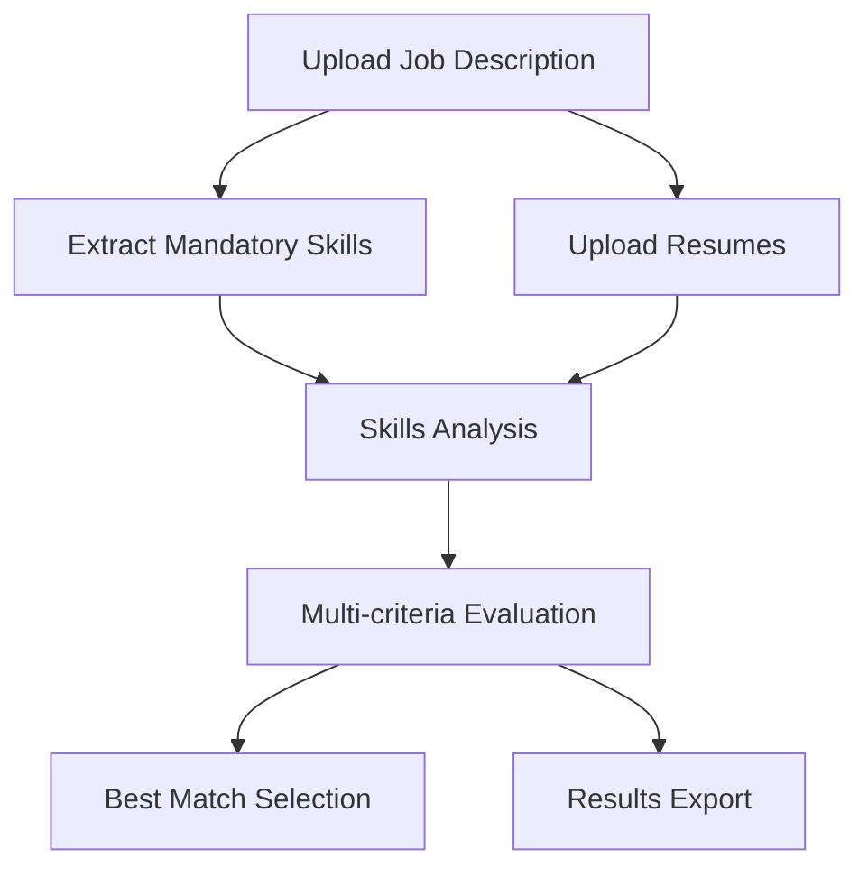

# Resume Analyzer

An AI-powered tool to analyze resumes against job descriptions using multiple LLM models for accurate candidate matching.

## Overview

This application uses LLMs to evaluate candidate resumes against job requirements, providing detailed scoring and recommendations for hiring decisions.

It uses a structured workflow to analyze both job descriptions and resumes, extracting key information and providing comprehensive matching scores.

Here's a breakdown of the workflow:

1. **Job Description Analysis**: The LLM analyzes the job description to identify mandatory skills and requirements.
2. **Resume Text Extraction**: The system processes uploaded resumes (PDF/DOCX) to extract structured text content.
3. **Skills Evaluation**: Mandatory and optional skills are evaluated against each candidate's experience.
4. **Multi-criteria Analysis**: Each resume is scored across multiple dimensions:
   - Overall fit score
   - Mandatory skills matching
   - Domain knowledge
   - Relevant experience
5. **Best Match Selection**: A specialized LLM evaluation identifies the most suitable candidate based on all criteria.



## Features

- Multi-format document support:
  - PDF parsing with PDF.js
  - DOCX parsing with Mammoth.js
  - Plain text fallback
- AI-powered analysis:
  - Automatic skill extraction
  - Experience evaluation
  - Candidate scoring
- Customizable evaluation:
  - Adjustable skill weightages
  - Optional skills support
  - Additional instructions
- Results management:
  - Tabular results display
  - CSV export functionality
  - Best match recommendations
- Dark mode support with auto/light/dark theme options

## Usage

1. Upload a job description file (PDF/DOCX)
2. Review and customize extracted mandatory skills
3. Add optional skills and additional instructions
4. Upload candidate resumes (multiple files supported)
5. Click "Analyse Resumes" to process candidates
6. Review detailed results in the table
7. Export results as CSV or get best match recommendation

## Setup

### Prerequisites

- Modern web browser with JavaScript enabled
- Access to LLM Foundry API endpoints

### Local Setup

1. Clone this repository:

```bash
git clone https://github.com/gramener/resumeanalyzer.git
cd resumeanalyzer
```

2. Serve the files using any static web server. For example, using Python:

```bash
python -m http.server
```

3. Open `http://localhost:8000` in your web browser

## Technical Details

### Architecture

- Frontend: Vanilla JavaScript with Bootstrap UI
- Document Processing: PDF.js and Mammoth.js
- LLM Integration: OpenAI GPT-4 through LLM Foundry API
- Styling: Bootstrap 5.3.3 with dark mode support

### Dependencies

- [Bootstrap](https://www.npmjs.com/package/bootstrap) - UI framework and styling
- [Bootstrap Icons](https://www.npmjs.com/package/bootstrap-icons) - Icon system
- [Mammoth.js](https://www.npmjs.com/package/mammoth) - DOCX processing
- [PDF.js](https://www.npmjs.com/package/pdfjs-dist) - PDF processing
- [Gramex UI](https://www.npmjs.com/package/@gramex/ui) - Dark theme support

### LLM Models

Uses OpenAI's GPT-4 models through LLM Foundry for:

- Skill extraction from job descriptions
- Resume analysis and scoring
- Best match determination
- Final recommendations

## License

[MIT](LICENSE)
